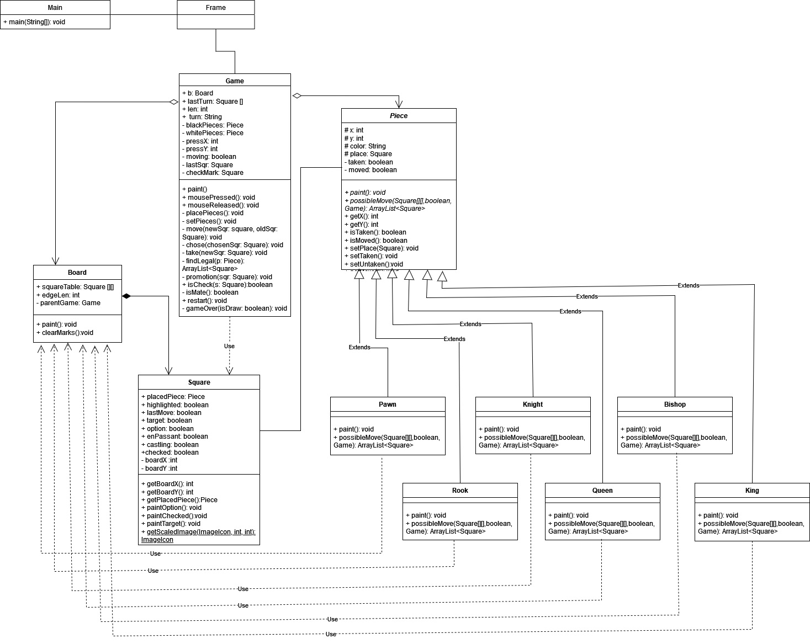
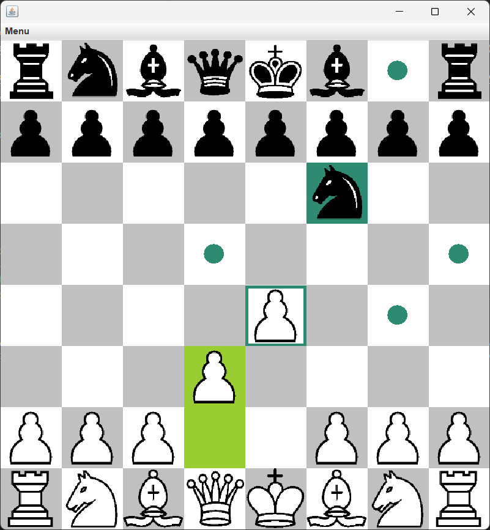

<header>

# Chess project

Program is intended to serve as a chessboard.
Created by: Filip Baranowski, 155828

</header>

The program displays a chessboard with pieces set out on it. When you click on a given piece, all the squares to which it can be moved are highlighted. Program allows only for legal moves to be made.
It highlights checks and detects the end of the game (either mate or draw). It takes into the account all the special moves that are in the official rules, that is castling, enpassant and promotion.

## Implementation:

### The most important classes:

**Game**: This class is responsible for the game logic. It creates a chessboard and sets out all the pieces. It manages turn changes, and listens for mouse clicks.
It has methods for manipulating the state of the board and the pieces, which for example, mark appropriate squares as highlighted or change the coordinates of the pieces.
It also checks for the end of the game after each move and displays a pop-up message if necessary.

**Board**: This class stores all 64 squares and is responsible for painting the chessboard with highlighted squares and placed pieces.

**Square**: This class holds the state of a given square. It contains the information about its coordinates, the way it shoud be displayed and which piece, if any, is placed on it.

**Frame**: Creates the game and a menu with an option to restart it.

**Piece**: An abstract class that contains all types of attributes and methods that are universal to each of its subclasses, such as the coordinates of a give piece, and also two abstract methods: *paint()* and *possibleMove()*, that are appropriately overridden by each of those classes.

In total, there are six derived classes: **Pawn**, **Knight**, **Bishop**, **Rook**, **Queen** and **King**. Each is responsible for determining the possible moves in a given situation and displaying the piece.

### Used Programming paradigms:

**Polymorthism** – seen in different implementations of methods *paint()* and *possibleMove()* in each of the classes derived from the class Piece.

**Inheritance** – for example, Piece class having a Pawn subclass  that inherits some of the logic.

**Encapsulation** – hiding the internal structure of a class, for example through the *setPlace()* method of the Piece class, which not only sets the value of the place attribute but also updates the coordinates of the piece accordingly.

**Data abstraction** – for example, an abstract class Piece which defines common characteristics of all pieces but without specifying the details of each one of them.

In the project, I used three types of access modifiers: *public*, *private* and *protected*. Access to private attributes, which were needed outside of their own object, was done through *getters* and *setters*.

### Gallery

<table>
  <tr>
    <td>UML diagram</td>
    <td>Chessboard view</td>
  </tr>
  
  <tr>
    <td></td>
    <td></td>
  </tr>

</table>

